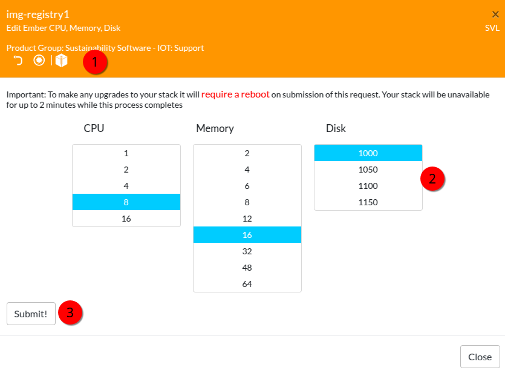

# prepare VM

## Deploy VM
deploy a Redhat 8 image on Fyre.  
when deployed, extend disk via EDIT EMBER menu in fyre.ibm.com/stacks  
set the new size of the disk and submit.  
repeat until you have the size you need.



## Extend disk

open a shell session as root.

List block devices:
```
lsblk
NAME          MAJ:MIN RM  SIZE RO TYPE MOUNTPOINT
sr0            11:0    1 1024M  0 rom
vda           252:0    0  1.2T  0 disk
```
vda above reflects newly added space,1.2 TB in this case.

Create a new partition using fdisk, the use the interactive options:
```
fdisk /dev/vda

Command (m for help): p
Disk /dev/vda: 1.2 TiB, 1288490188800 bytes, 2516582400 sectors
…
…

Feedback
Command (m for help): new

<all defaults>

Created a new partition 3 of type ‘Linux’ and of size 950 GiB.
Command (m for help): t
Partition number (1-3, default 3):Hex code (type L to list all codes): 8e
Changed type of partition ‘Linux’ to ‘Linux LVM’.
Command (m for help): w
```
The partition table has been altered.  
Syncing disks, you can verify with:
```
fdisk -l /dev/vda
```
```
sync;reboot
```


```
lsblk
```

list the physical volumes
```
pvdisplay
```

create a new physical volume
```
pvcreate /dev/vda3
```

list the volume groups
```
vgdisplay
```

extend the volme group
```
vgextend rhel /dev/vda3
```

list the logical volumes
```
lvdisplay
```

extend the logical volume
```
lvextend -l+100%FREE /dev/rhel/root
```

expand the XFS filesystem

```
xfs_growfs /
```

verify the file system space usage
```
df -h
```
